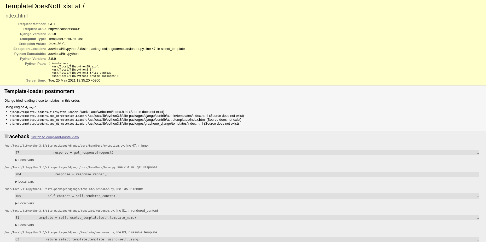

# Django + DRF

[Django Docs](https://docs.djangoproject.com) | [DRF](https://www.django-rest-framework.org) | [REST](https://restfulapi.net) | [PostgreSQL Docs](https://www.postgresql.org/docs/current/app-psql.html)

## Stack:
* Django
* DRF
* PostgreSQL
* Docker + Docker-compose
* Gunicorn
---
## Develop:

To work with the project, you need to install [vscode](https://code.visualstudio.com/) and [vscode-remote-containers](https://code.visualstudio.com/docs/remote/containers).

### Config
To generate a config:
```bash
./deploy.sh config
```

### Environment variables
 * `SECRET_KEY` - Django secret key. For generate new once, you can use service https://djecrety.ir/
 * `DEBUG` - Flag to tell django work on debug mode or not.
* `DB_NAME` - PostgreSQL db name.
* `DB_USER` - PostgreSQL db user.
* `DB_PASSWORD` - PostgeSQL db password.


### Codding

For developing backend with django, open django project in vscode and reopen it in container.


```bash
code kernel
```


For migrate:
```bash
./manage.sh migrate
```

For create new django app:
```bash
./manage.sh app
```

It will create new django app with this structure:
```
app/
├── admin
│   └── __init__.py
├── apps.py
├── __init__.py
├── models
│   └── __init__.py
├── serializers
│   └── __init__.py
├── views
│   └── __init__.py
└── services
    └── __init__.py
```

Create superuser:
```bash
./manage.sh su
```

To debug django code use cmd+F5

Open http://localhost:8000 you will see this and this is normall. There is no builded webclient.



Open http://localhost:8000/admin to see admin dashboard.


### Deploy
For deploy run:
```bash
./deploy.sh
```

On local machine app will running on http://0.0.0.0/


&copy; Gen by [PBD](https://lyaguxafrog/python-backend-devcontainers) with 💚
